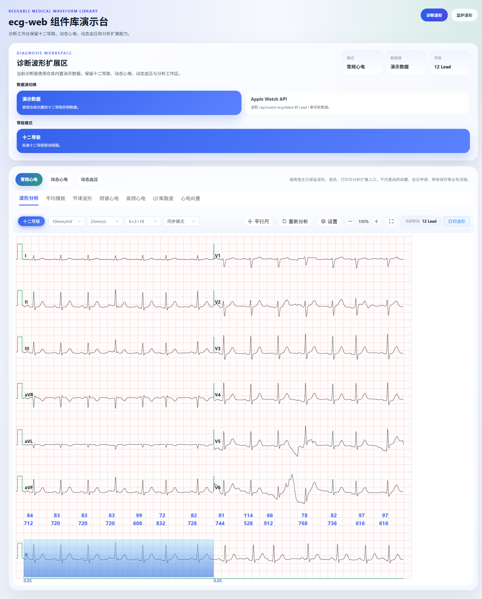
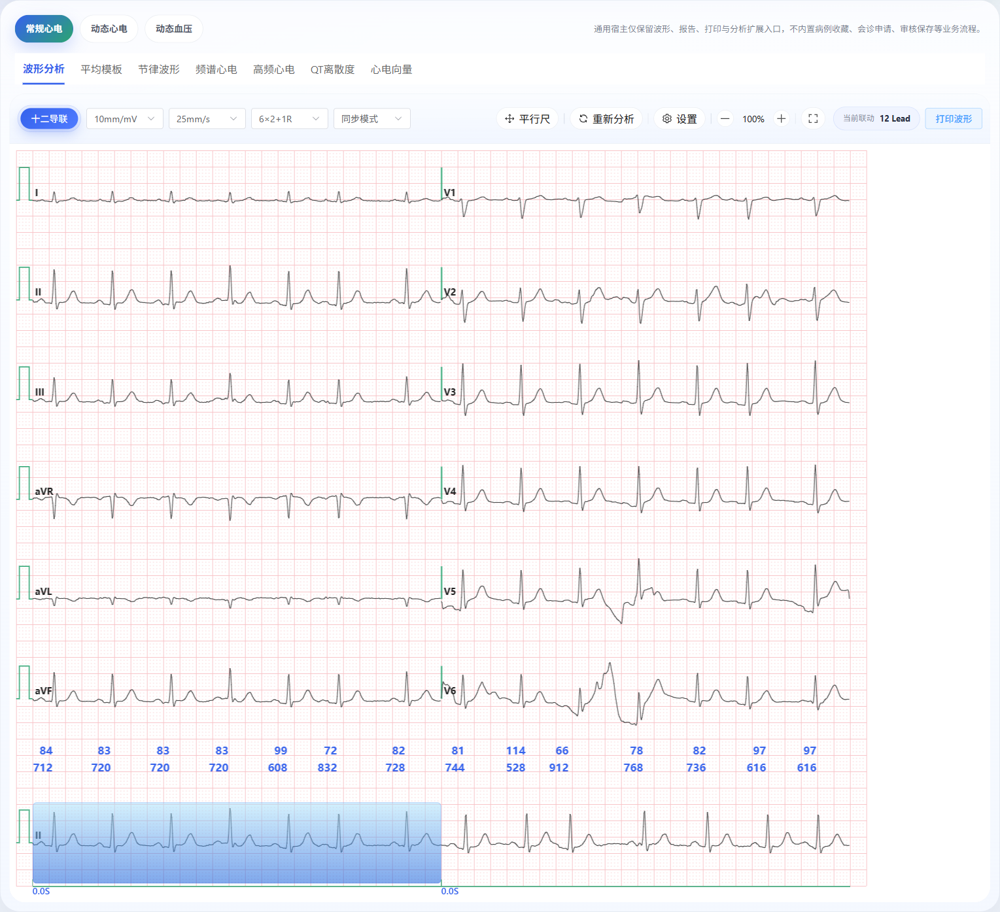
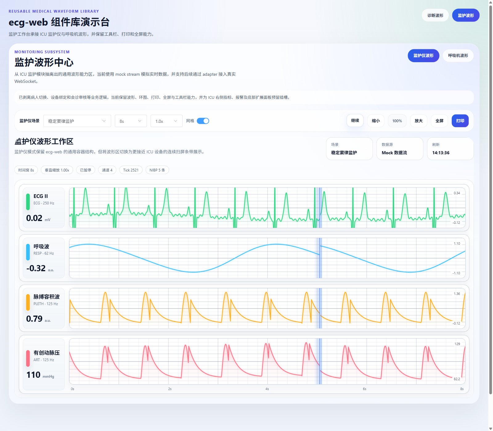
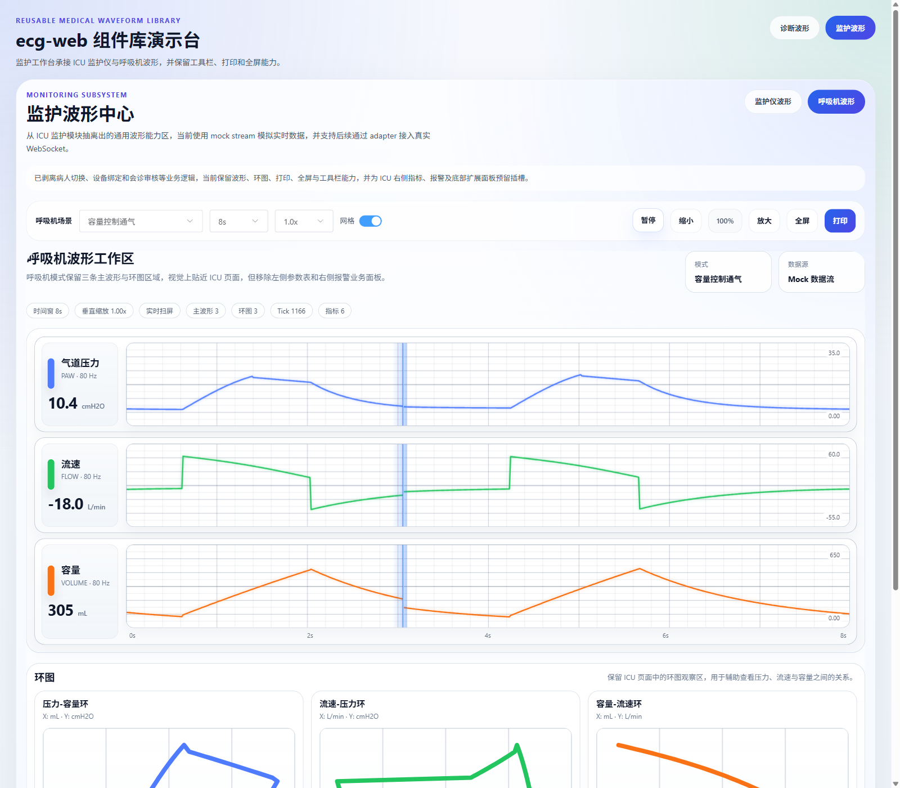
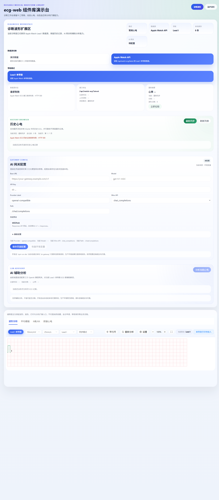

# ecg-web

一个基于 Vue 3 + Vite 的医疗波形工作台与组件库，覆盖标准 ECG 诊断、Apple Watch ECG 接入、AI 辅助分析，以及 ICU 监护仪 / 呼吸机波形展示。

## 项目概览

这个项目不是单一的波形组件示例，而是一个可直接演示的医疗波形工作台。当前界面分为两大功能面：

- `诊断波形`：面向标准 ECG、报告与分析工作区
- `监护波形`：面向 ICU 监护仪与呼吸机连续波形展示

适合用于以下场景：

- 医疗波形界面原型与前端演示
- 心电诊断工作台开发
- Apple Watch ECG 本地联调
- ICU 监护仪 / 呼吸机波形界面复用
- 波形渲染、打印、工具栏等能力抽取

## 功能预览

### 工作台总览

项目采用单页工作台组织方式，支持在诊断波形与监护波形之间快速切换，便于直接理解完整产品形态。



### 标准 ECG 诊断工作台

提供十二导联标准心电展示、工具栏、打印入口与分析页签切换，是项目当前最核心的诊断界面。



### ICU 监护仪波形

监护仪页面采用连续条带扫屏展示，强调多通道实时监护体验，并保留时间窗、缩放、打印等通用能力。



### ICU 呼吸机波形与环图

呼吸机页面保留压力、流速、容量三条主波形以及环图区，用于展示 ICU 风格的连续扫屏与参数关系观察。



### Apple Watch ECG 与 AI 辅助分析

支持切换到 Apple Watch ECG 数据源，展示历史记录、AI 网关配置与辅助分析卡片，适合本地联调单导联 ECG 场景。



## 核心能力

- 标准 ECG 诊断工作台
- 动态心电 / 动态血压报告视图
- 波形分析、平均模板、节律波形、频谱心电、高频心电、QT 离散度、心电向量等分析页签
- Apple Watch ECG 本地 API 接入
- AI 网关配置与辅助分析卡片
- ICU 监护仪连续条带扫屏波形
- ICU 呼吸机连续条带扫屏波形与环图
- 打印、缩放、工具栏与波形交互能力

## 技术栈

- Vue 3
- Vite
- Element Plus
- Sass

## 快速开始

安装依赖：

```bash
npm install
```

启动本地开发：

```bash
npm run dev
```

构建生产产物：

```bash
npm run build
```

本地预览构建结果：

```bash
npm run preview
```

## Apple Watch ECG 本地联调

如果需要联调本地 Apple Watch ECG API：

```bash
cd server
go run ./cmd/watch-ecg-server
```

如果需要让局域网中的 iPhone 访问本机服务：

```bash
cd server
WATCH_ECG_ADDR=0.0.0.0:8090 go run ./cmd/watch-ecg-server
```

健康检查：

```bash
curl http://127.0.0.1:8090/healthz
```

写入一条 Lead I 单导联记录：

```bash
node <<'NODE' | curl -X POST http://127.0.0.1:8090/api/v1/watch-ecg/records \
  -H 'Content-Type: application/json' \
  --data-binary @-
const waveform = Array.from({ length: 2560 }, (_, index) =>
  Number((Math.sin(index / 18) * 0.14 + Math.sin(index / 3) * 0.01).toFixed(6)),
);

process.stdout.write(JSON.stringify({
  patientId: "pat_local_001",
  encounterId: "enc_local_001",
  source: "apple_watch",
  sourceRecordId: "watch-record-001",
  recordedAt: "2026-03-25T10:30:00+08:00",
  sampleRate: 512,
  duration: 5,
  leadMode: "leadI",
  leadName: "I",
  waveform,
  summary: {
    hr: 72,
    classification: "sinus_rhythm",
  },
  device: {
    watchModel: "Apple Watch Series 9",
  },
}));
NODE
```

读取最新记录：

```bash
curl "http://127.0.0.1:8090/api/watch-ecg/latest?patientId=pat_local_001"
```

读取历史记录摘要：

```bash
curl "http://127.0.0.1:8090/api/watch-ecg/records?patientId=pat_local_001&limit=10"
```

## 目录结构

```text
server/
  cmd/watch-ecg-server/  本地 Go + SQLite ECG API
src/
  lib/
    components/          诊断与监护工作台组件
    composables/         复用逻辑
    demo/                演示数据
    styles/              样式变量
    utils/               波形渲染、打印与适配工具
```

## 主要导出

当前库从 `src/lib/index.js` 统一导出，核心包括：

- `WaveformCenter`
- `MonitoringCenter`
- `MonitorRealtimeWorkspace`
- `VentilatorRealtimeWorkspace`
- `StandardWaveformWorkspace`
- `AverageTemplateWorkspace`
- `ReportWorkspace`
- `SpectrumAnalysisWorkspace`
- `HighFrequencyEcgWorkspace`
- `QtDispersionWorkspace`
- `VectorEcgWorkspace`
- `WaveformToolbar`
- `WaveformTimeNavigatorBar`
- `WaveformContextMenu`
- `WaveformSettingsDialog`
- `StreamingWaveformCanvas`
- `normalizeMonitorPayload`
- `normalizeVentilatorPayload`
- `useMockMonitorStream`
- `useMockVentilatorStream`

## 仓库说明

- 仓库提交源码，不提交 `dist/` 构建产物。
- 前端开发态通过 Vite 代理将 `/api/*` 转发到本地 Go 服务。
- Apple Watch 本地协议说明见 `docs/watch-ecg-api.md`。
- iOS 桥接 App 位于 `ios/WatchEcgBridge`，用于“新 ECG 生成后自动上传”。
- 演示数据中的公司、医院等信息已做脱敏处理。
- 如果后续需要发布到 npm，请将 `package.json` 中的 `private` 调整为 `false`，并补充 `repository`、`license`、`files` 等字段。